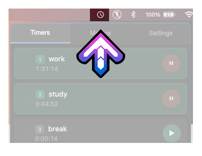
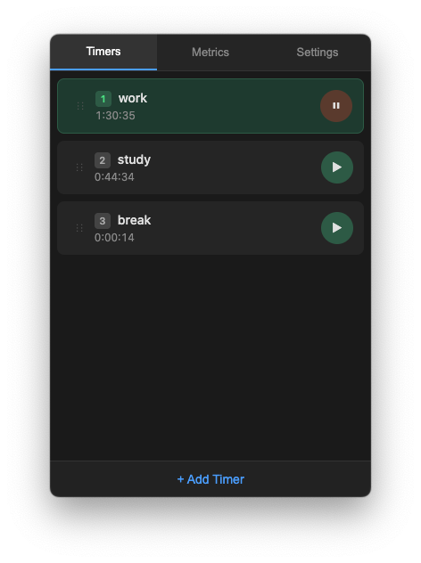
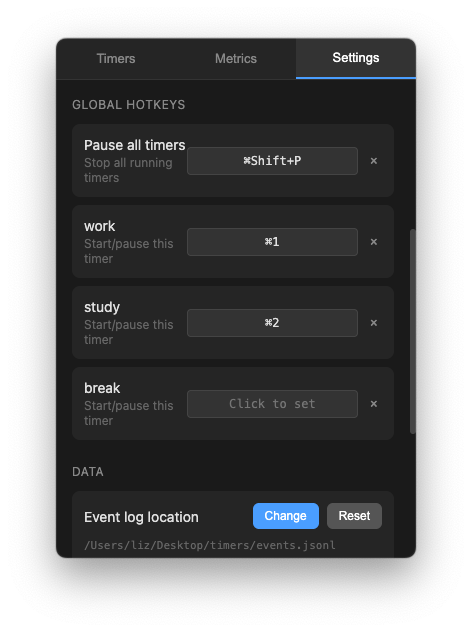
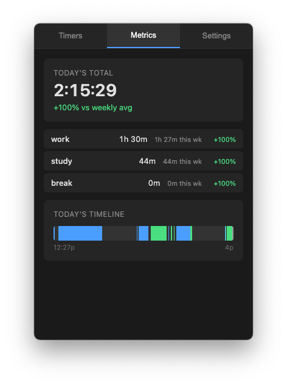
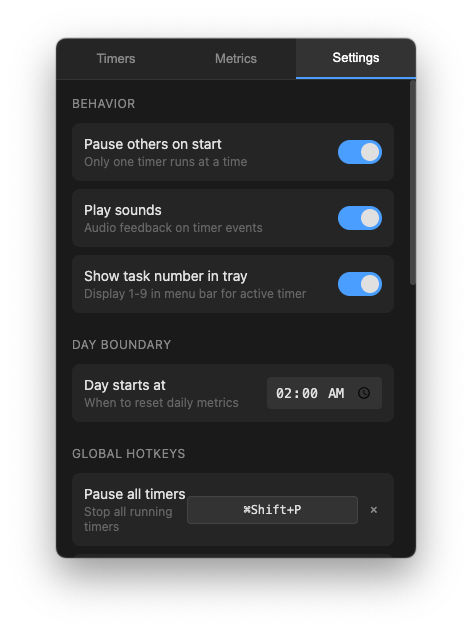

# Universal Timer

A lightweight time tracker that lives in your macOS menu bar. Start and stop named timers with a click or a global hotkey — no windows cluttering your workspace, no accounts, no cloud. Your data stays on your machine.

## Features

**Quick access from the menu bar** — Click the tray icon to open the timer panel. It stays out of your way until you need it.



**Multiple named timers** — Track as many tasks as you want. Drag to reorder, right-click to rename or delete. Timers show elapsed time for the current day and update live.



**Global hotkeys** — Assign keyboard shortcuts to start/pause individual timers or pause everything at once, even when the app is in the background.



**Daily metrics and timeline** — See your total tracked time, per-task breakdown, and a color-coded timeline of your day. Weekly trends show how today compares to your average.



**Configurable day boundaries** — Night owl? Set your "day" to start at 4am or whenever makes sense for you.

**Crash-safe** — Timer state is stored in an append-only event log. If the app quits unexpectedly, nothing is lost.



**Export and import** — Back up your data or move it between machines with a single JSON file.

**No framework, no telemetry, no network calls** — Just Electron and TypeScript.

## Build

Requires Node.js 18+.

```
git clone https://github.com/vorpus/universal-timer.git
cd universal-timer
npm install
npm run dist
```

Open `dist/mac-arm64/Universal Timer.app` (Apple Silicon) or `dist/mac/Universal Timer.app` (Intel).
